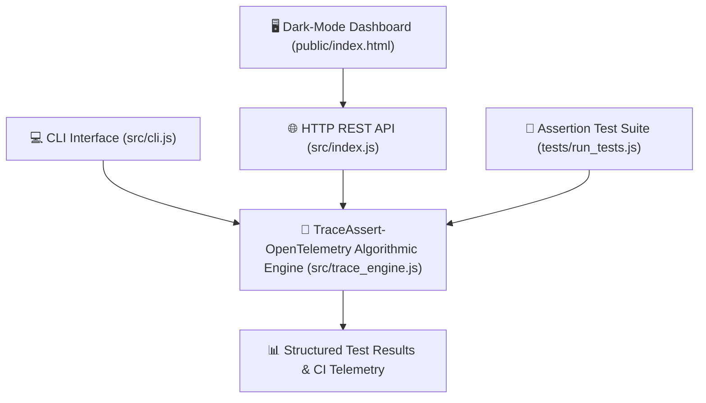

# 📐 System Architecture: TraceAssert-OpenTelemetry
- **Project:** TraceAssert-OpenTelemetry
- **Discipline:** Trace-Driven Testing & OpenTelemetry Observability
- **Author:** Expert Software Architect
- **Status:** APPROVED

## 1. High-Level Architecture Topology

## 2. Component Breakdown
1. **Algorithmic Engine (`src/trace_engine.js`):** Core logic implementing Trace-Driven Testing & OpenTelemetry Observability. Zero third-party runtime bloat.
2. **REST API & Web Server (`src/index.js`):** Lightweight HTTP microservice running on port 7074 providing health probes and interactive endpoints.
3. **Interactive Console (`public/index.html`):** Dark-mode responsive diagnostic dashboard with live metric cards and JSON inspection.
4. **CLI Entrypoint (`src/cli.js`):** Developer terminal interface for local CI script execution.
5. **Deterministic Test Suite (`tests/run_tests.js`):** Rigorous, non-mocked assertions verifying boundary conditions, error handling, and performance.
